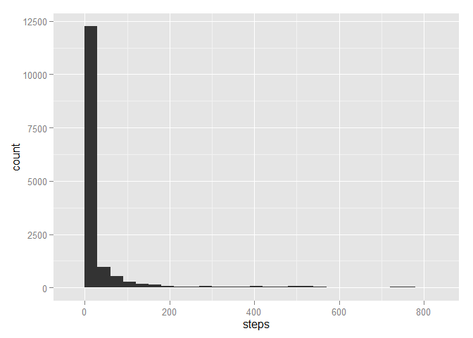
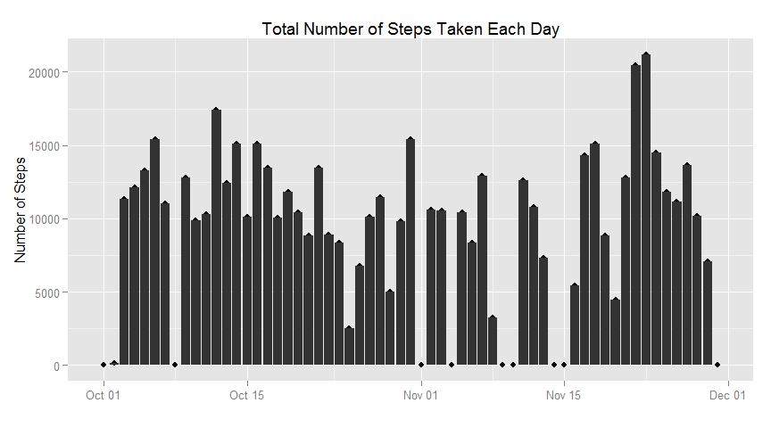
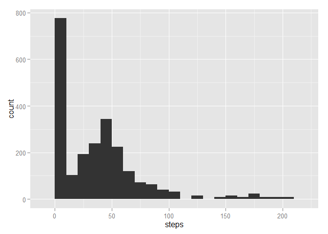
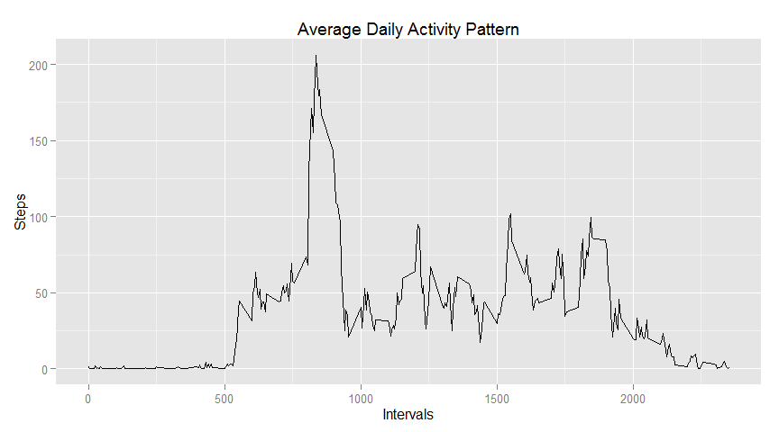

# Reproducible Research: Peer Assessment 1
Bosah Chude  
Friday, October 17, 2014  


## Loading and preprocessing the data


```r
library(lubridate)
library(ggplot2)
library(gridExtra)
```

```
## Loading required package: grid
```

```r
library(dplyr)
```

```
## 
## Attaching package: 'dplyr'
## 
## The following objects are masked from 'package:lubridate':
## 
##     intersect, setdiff, union
## 
## The following objects are masked from 'package:stats':
## 
##     filter, lag
## 
## The following objects are masked from 'package:base':
## 
##     intersect, setdiff, setequal, union
```

```r
unzip("activity.zip")
activityData <- read.csv("activity.csv", stringsAsFactors = FALSE)
activityData$date <- ymd(activityData$date)

head(activityData)
```

```
##   steps       date interval
## 1    NA 2012-10-01        0
## 2    NA 2012-10-01        5
## 3    NA 2012-10-01       10
## 4    NA 2012-10-01       15
## 5    NA 2012-10-01       20
## 6    NA 2012-10-01       25
```

## What is mean total number of steps taken per day?

```r
qplot(steps, data = activityData, geom = "histogram", binwidth = 30)
```

 

```r
mean(activityData$steps, na.rm = TRUE)
```

```
## [1] 37.3826
```

```r
median(activityData$steps, na.rm = TRUE)
```

```
## [1] 0
```

## What is the average daily activity pattern?

```r
meanActivityData <- tapply(activityData$steps, activityData$interval, mean, na.rm = TRUE)
meanDF <- as.data.frame.array(meanActivityData)
colnames(meanDF) <- "steps"
meanDF <- mutate(meanDF, interval = as.numeric(row.names(meanDF)))
ggplot(data = meanDF, aes(x = interval, y = steps)) + geom_line()
```

 

```r
meanActivityData[which.max(meanActivityData)]
```

```
##      835 
## 206.1698
```

## Imputing missing values

```r
sum(!complete.cases(activityData))
```

```
## [1] 2304
```

```r
missingActivityData <- activityData[!complete.cases(activityData),]

for(i in 1:nrow(missingActivityData)) {
    missingActivityData[i,][1] <- meanActivityData[as.character(missingActivityData[i,][3])]    
}
head(missingActivityData)
```

```
##       steps       date interval
## 1 1.7169811 2012-10-01        0
## 2 0.3396226 2012-10-01        5
## 3 0.1320755 2012-10-01       10
## 4 0.1509434 2012-10-01       15
## 5 0.0754717 2012-10-01       20
## 6 2.0943396 2012-10-01       25
```

```r
qplot(steps, data = missingActivityData, geom = "histogram", binwidth = 10)
```

 

```r
mean(missingActivityData$steps, na.rm = TRUE)
```

```
## [1] 37.3826
```

```r
median(missingActivityData$steps, na.rm = TRUE)
```

```
## [1] 34.11321
```

## Are there differences in activity patterns between weekdays and weekends?

```r
mutatedActivityData <- mutate(activityData, week = weekdays(date))
head(mutatedActivityData)
```

```
##   steps       date interval   week
## 1    NA 2012-10-01        0 Monday
## 2    NA 2012-10-01        5 Monday
## 3    NA 2012-10-01       10 Monday
## 4    NA 2012-10-01       15 Monday
## 5    NA 2012-10-01       20 Monday
## 6    NA 2012-10-01       25 Monday
```

```r
weekendActivityData <- filter(mutatedActivityData, week == "Saturday" | week == "Sunday" )
weekdayActivityData <- filter(mutatedActivityData, week != "Saturday" & week != "Sunday" )


weekdaySummary <- tapply(weekdayActivityData$steps, 
                         weekdayActivityData$interval, mean, na.rm = TRUE)
weekdayDF <- as.data.frame.array(weekdaySummary)
colnames(weekdayDF) <- "steps"
weekdayDF <- mutate(weekdayDF, interval = as.numeric(row.names(weekdayDF)))


weekendSummary <- tapply(weekendActivityData$steps, 
                         weekendActivityData$interval, mean, na.rm = TRUE)
weekendDF <- as.data.frame.array(weekendSummary)
colnames(weekendDF) <- "steps"
weekendDF <- mutate(weekendDF, interval = as.numeric(row.names(weekendDF)))

plot1 <- ggplot(data = weekdayDF, aes(x = interval, y = steps)) + geom_line()
plot2 <- ggplot(data = weekendDF, aes(x = interval, y = steps)) + geom_line()

grid.arrange(plot1, plot2, nrow = 2, ncol = 1)
```

 


